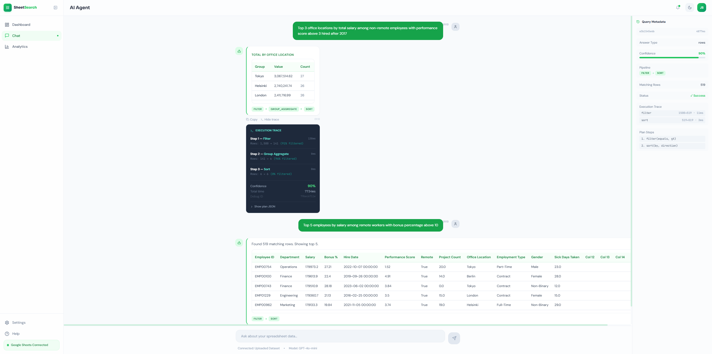
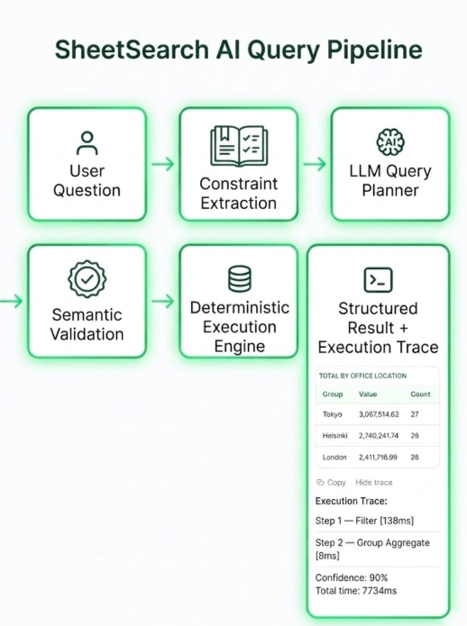
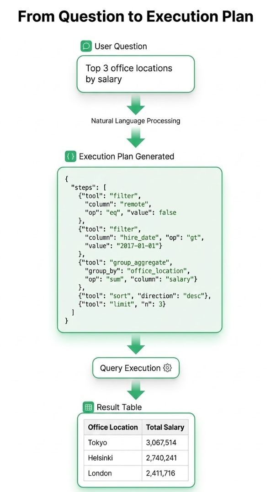

# SheetSearch AI

Natural language → deterministic spreadsheet queries.

Upload a CSV/XLSX file and ask questions like:

"Top 3 office locations by total salary among non-remote employees hired after 2017"

---

## Demo

---

## How It Works

  
  

---

## Example Query

Top 3 office locations by total salary among non-remote employees hired after 2017

Execution Plan:

filter(remote=false)  
filter(hire_date > 2017)  
group_aggregate(office_location, sum(salary))  
sort(desc)  
limit(3)

---

## Tech

FastAPI  
Pandas  
React  
Tailwind  
OpenAI GPT-4o-mini