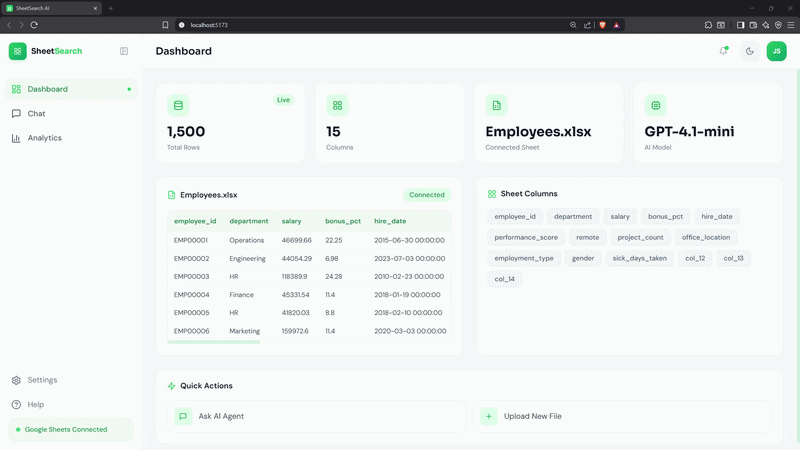
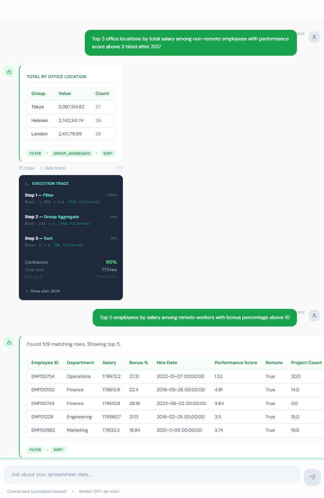
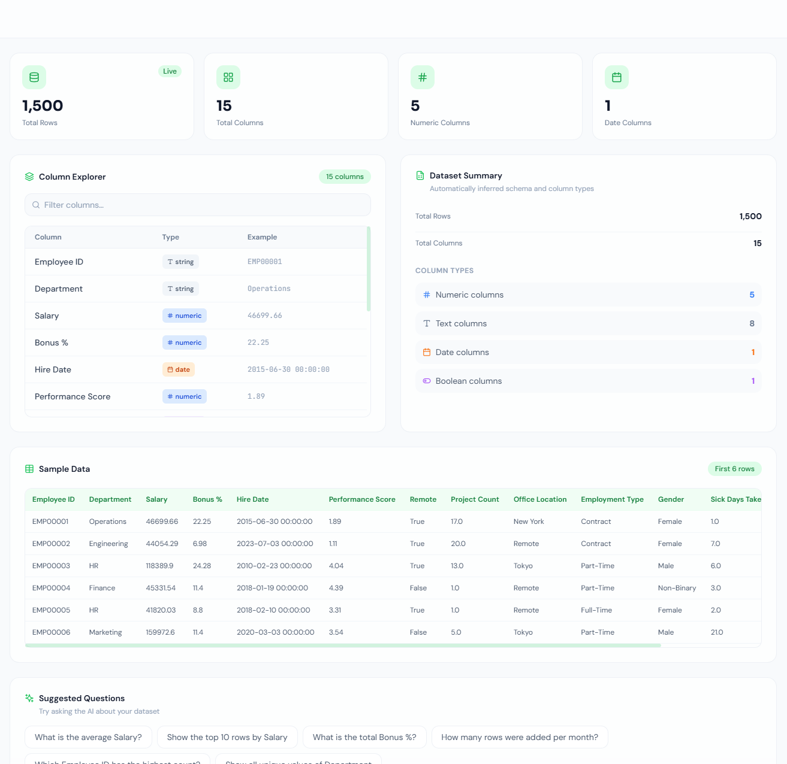

# SheetSearch AI

Natural language → deterministic spreadsheet queries.

Upload a CSV/XLSX file and ask questions like:

*"Top 3 office locations by total salary among non-remote employees hired after 2017"*

<p align="center">
  
</p>

---

## How It Works

<p align="center">
  
</p>

<p align="center">
  
</p>

---

## Landing Page

<p align="center">
  
</p>

## Chat Page

<p align="center">
  
</p>

## Analytics Page

<p align="center">
  
</p>

---

## Example Query

Top 3 office locations by total salary among non-remote employees hired after 2017

Execution Plan:
```
filter(remote=false)
filter(hire_date > 2017)
group_aggregate(office_location, sum(salary))
sort(desc)
limit(3)
```

---

## Tech

- FastAPI 
- React & Vite  
- Tailwind CSS 
- Recharts 
- OpenAI GPT-4o-mini 
- Openpyxl 